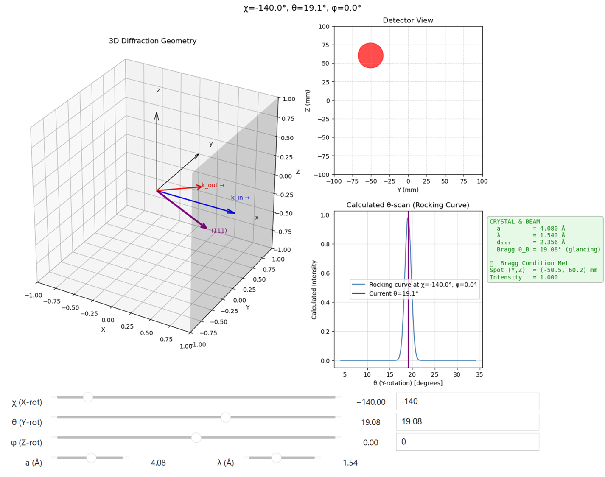

# XRDSimulator: Interactive Single-Crystal X-ray Diffraction Demo

**Developed by Dr. Yugang Zhang** **Date**: 2025-08-10

This project provides an interactive simulation of single-crystal X-ray diffraction from the (111) plane of an FCC crystal. It visualizes the diffraction geometry, detector signal, and rocking curve as a function of crystal rotation, lattice constant, and X-ray wavelength.


 

---

## ✨ Features

- **Interactive 3D Visualization:** See the beam, crystal, and detector geometry in real-time.
- **Bragg's Law Simulation:** Accurately simulates Bragg diffraction and calculates the resulting spot position on the detector.
- **Real-Time Rocking Curve:** Plots the diffraction intensity versus the crystal's rocking angle ($\theta$-scan).
- **Adjustable Parameters:** Easily modify crystal rotation angles ($\chi, \theta, \phi$), lattice constant ($a$), and X-ray wavelength ($\lambda$).

---

## 🧪 Installation

1.  **Create a Virtual Environment** (optional but recommended):
    ```bash
    python -m venv xrd_env
    source xrd_env/bin/activate  # On Windows, use `xrd_env\Scripts\activate`
    ```

2.  **Install Dependencies:**
    ```bash
    pip install -r requirements.txt
    ```

---

## 🚀 Quick Start

You can run the interactive simulation from a Python script or a Jupyter Notebook.

```python
from xrdsimulator import XRDSimulator

# 1. Initialize the simulator with a lattice constant (e.g., for Gold)
#    and X-ray wavelength (e.g., Copper K-alpha).
sim = XRDSimulator(a=4.08, wavelength=1.54)

# 2. Set crystal rotation angles and calculate diffraction.
#    The Bragg angle for Au(111) with Cu K-alpha is ~19.1 degrees.
y, z, intensity = sim.calculate_diffraction(
    chi_deg=10,
    theta_deg=19.1,
    phi_deg=0
)

print(f"Detector Hit: (y={y:.2f}, z={z:.2f}), Intensity: {intensity:.3f}")

# 3. Launch the interactive visualization.
fig = sim.visualize_setup(
    chi_deg=10,
    theta_deg=19.1,
    phi_deg=0
)
fig.show()

# Or, to run the full interactive demo in a Jupyter Notebook:
# %matplotlib inline
# from xrdsimulator import interactive_simulation
# interactive_simulation()
```

---

## 🧠 Understanding the Simulation

This simulation is built on the principles of crystallographic rotation, Bragg's Law, and vector geometry.

---

### Crystal Rotation Explained

The orientation of the crystal's (111) plane is controlled by three rotations applied in the **Z → Y → X** order. The final rotation matrix $R$ is given by:

$$R = R_X(\chi) R_Y(\theta) R_Z(\phi)$$

- **Rotation around Z-axis ($\phi$):** This is an azimuthal rotation around the initial surface normal. For the (111) plane, this rotation has no effect on diffraction since the normal vector lies on the rotation axis.
- **Rotation around Y-axis ($\theta$, Rocking Scan):** This is the **most critical rotation**. A diffraction spot only appears when $\theta$ is almost exactly the Bragg angle ($\theta_B$). A plot of intensity vs. $\theta$ is called a **rocking curve**. For a perfect single crystal, this peak is extremely narrow.
- **Rotation around X-axis ($\chi$, Beam Direction):** If the Bragg condition is already met (i.e., $\theta = \theta_B$), rotating around the incoming beam axis will cause the diffraction spot to trace a circle on the detector. This circle is the intersection of the **Debye-Scherrer cone** with the flat detector plane.

---

### Diffraction Condition and Intensity Model

A diffraction signal is generated when the angle between the incoming X-ray beam and the crystal plane satisfies **Bragg's Law**:

$$n \lambda = 2d \sin(\theta_B)$$

The intensity of the diffraction spot is modeled using a **Gaussian distribution** centered at the ideal Bragg angle $\theta_B$:

$$I = \exp\left( - \left( \frac{\theta - \theta_B}{W} \right)^2 \right)$$

Where:
- $\theta - \theta_B$ is the deviation from the Bragg angle in degrees.
- $W$ is the peak width (a standard deviation of $1^\circ$ is used in the code).

---

### Detector Projection

If the Bragg condition is met, the simulator calculates the direction of the diffracted X-ray beam, $\vec{k}_{\text{out}}$, using the law of reflection:

k_out = k_in - 2(k_in ⋅ n) n

    $\vec{k}_{\text{out}}$ =  $\vec{k}_{\text{in}}$ - 2 ($\vec{k}_{\text{in}}$ $\cdot$ $\vec{n}$)  $\vec{n}$ 
 

- $\vec{k}_{\text{in}}$ is the incoming beam vector, fixed along the X-axis: $(1, 0, 0)$.
- $\vec{n}$ is the normal vector of the (111) plane after rotation.

The coordinates $(y, z)$ of the diffraction spot are then calculated by finding where the $\vec{k}_{\text{out}}$ vector intersects the detector plane, which is fixed at a distance $L$ from the crystal.

---

## 🛠️ Limitations & Future Improvements

### Current Limitations
- **Single Plane:** Only simulates diffraction from the (111) plane of an FCC crystal.
- **Monochromatic Beam:** Assumes a perfectly monochromatic X-ray beam.
- **Ideal Crystal:** Does not account for real-world effects like mosaic spread, beam divergence, or orientation distribution.
- **Simple Intensity Model:** Uses a Gaussian model, not a full dynamical or kinematical diffraction theory.
- **Fixed Detector:** Assumes a flat detector in the YZ plane.

### Potential Future Work
- Support for multiple crystallographic planes: (100), (110), etc.
- Visualization of the Ewald sphere and reciprocal space.
- Simulation of multiple wavelengths or continuous spectra.
- Integration of effects like sample mosaicity or beam divergence.
- Ability to export interactive or static snapshots as images or videos.

---

## 📬 Contact

For suggestions, bug reports, or feature requests, please contact:

**Dr. Yugang Zhang** Brookhaven National Laboratory  
📧 yuzhang@bnl.gov


